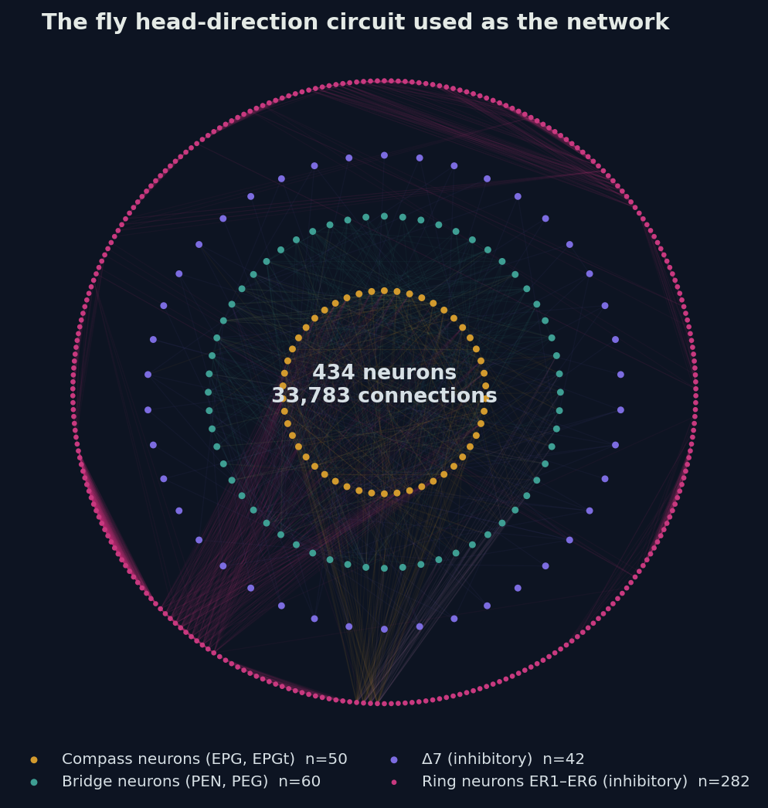
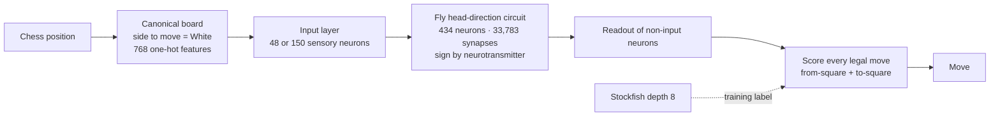
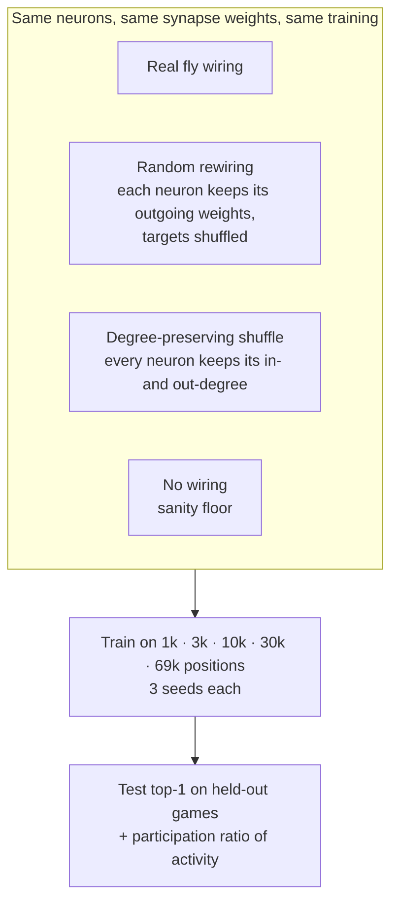
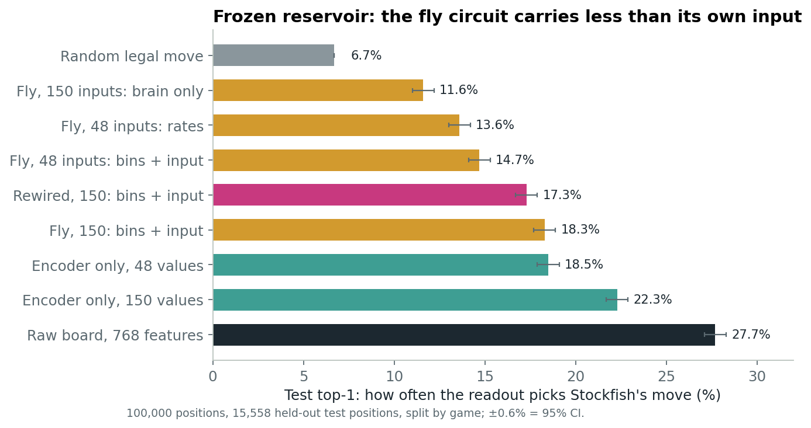
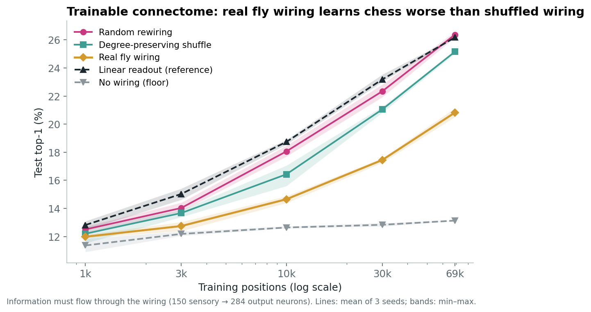
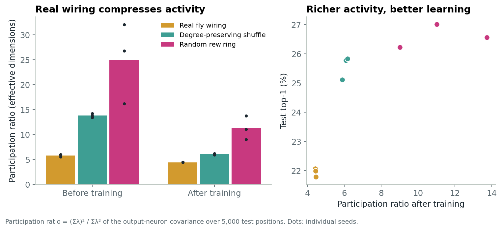

<div align="center">

# ChessFly

### Does real brain wiring help a network learn? A test with the fruit fly's compass and the game of chess


**[Interactive 3D mission](https://claude.ai/artifact/5cobwrSTvQWzB88KUtVBZe)** · **[Play chess against the fly](https://claude.ai/artifact/8gRB5DUGNV5WrG3kmYfL8s)** · **[Technical notes](docs/TECHNICAL.md)**



</div>

---

## Abstract

We use the synaptic wiring of the *Drosophila* head-direction circuit (434 neurons, 33,783 connections), taken from the male CNS connectome, as a neural network and ask whether its **real topology** helps it learn an abstract task, chess move prediction, compared with carefully matched **null wirings**. As a frozen spiking reservoir, the circuit carries board information but retains less of it than its own input encoding. When synapse strengths are trained and all information is forced to flow through the wiring, the **real connectome learns worse than random rewiring and worse than a degree-preserving shuffle** at four of five training-set sizes, for every seed. The real circuit's activity is also the **lowest-dimensional** of the three (participation ratio 4.4 vs. 6.1 and 11.3), in the same order as learning performance. We interpret this as a signature of **task-specific inductive bias**: the ring-attractor wiring that suits heading estimation constrains the network to few dimensions and costs it on unrelated tasks.

## Key findings

| # | Finding | Evidence |
|:-:|---|---|
| 1 | The frozen fly circuit is a **lossy channel** for board information | Brain-only readout 11.6% vs. its own 150-value input 22.3% (test top-1, n = 15,558) |
| 2 | With trained synapses, **real wiring learns worse** than shuffled wiring | 20.8% vs. 25.2% (degree-preserving) and 26.4% (rewired) at 69k positions; real loses at 4/5 sizes, worst-vs-best seed |
| 3 | Real wiring produces the **most compressed activity** | Participation ratio after training: 4.4 ± 0.0 vs. 6.1 ± 0.1 and 11.3 ± 2.4 (3 seeds) |
| 4 | Dimensionality **tracks learning** | Ordering real < degree-preserving < rewired is identical for dimensions and accuracy |

> **Scope.** The fly does not understand chess, and this is not a claim about fly intelligence. Chess is an abstract testbed for asking how evolved circuit structure shapes what a network can learn.

## Contents

1. [Question](#1-question)
2. [System](#2-system)
3. [Experimental design](#3-experimental-design)
4. [Results](#4-results)
5. [Interpretation](#5-interpretation)
6. [Limitations](#6-limitations)
7. [Reproducing the results](#7-reproducing-the-results)
8. [Interactive demos](#8-interactive-demos)
9. [Roadmap](#9-roadmap)
10. [Related work](#10-related-work)
11. [Citation and credits](#11-citation-and-credits)

---

## 1. Question

Brains are not blank slates. Much of their structure is specified before any learning happens, and a long-standing argument holds that this structure acts as an **inductive bias** that makes learning fast and data-efficient for the tasks an animal evolved for. Complete connectomes now let us test that idea directly: take a real circuit's wiring, train only what a brain would learn, and compare it with the same neurons wired differently.

> **Research question.** Does the real wiring of a fly circuit help a network learn a task, relative to null models that preserve its neurons, weights and connection counts?

## 2. System



**Circuit.** Cell types EPG, EPGt, PEG, PEN_a, PEN_b (cholinergic, excitatory), Δ7 (glutamatergic) and ER1–ER6 ring neurons (GABAergic), pulled from `male-cns:v1.0` on neuPrint. Connections with fewer than three synapses are dropped; 74.7% of neurons and 77.7% of synaptic weight are inhibitory.

**Two ways of running the circuit.**

| | Frozen spiking reservoir | Trainable connectome |
|---|---|---|
| Neuron model | Leaky integrate-and-fire, τ = 10 ms, threshold −50 mV, reset −65 mV, 3 ms refractory, 1 mV noise | Rate unit, h ← (1 − α)h + α(ReLU(h)W + Ux), α = 0.5, 10 steps |
| Synapses | Fixed: synapse count × 0.22 mV × sign | Fixed mask and sign (Dale's law); **magnitudes trained** |
| Input | Deterministic current into 48 or 150 neurons from a centered random projection of the board | Trained projection into 150 sensory neurons only |
| Readout | Spike counts (1 s, optionally 10 × 100 ms bins) of non-input neurons | ReLU activity of the other 284 neurons |
| Implementation | Brian2 reference; batched PyTorch GPU simulator validated against it (r = 0.999) | PyTorch |

**Legal moves by construction.** Each legal move is scored as `from_logit[from] + to_logit[to]` and a softmax is taken over legal moves only, so an illegal move can never be chosen.

## 3. Experimental design



- **Data.** 100,000 positions from Stockfish self-play (25% random moves) and games against a random opponent, labeled with Stockfish's best move at depth 8. Train/validation/test split **by game** (70/15/15) to prevent leakage between near-identical positions.
- **Information bottleneck.** In the trainable design the board enters only 150 sensory neurons and moves are read only from the remaining 284, so information must cross the synapses. The no-wiring condition confirms this: it stays at the level of predicting generically common moves.
- **Decision rule, fixed in advance.** Real wiring "wins" or "loses" at a data size only if its worst seed is above, or its best seed below, every seed of the control.
- **Dimensionality.** Participation ratio PR = (Σλ)² / Σλ², from the covariance of output-neuron activity over 5,000 test positions.

| Phase | Script | Purpose |
|---|---|---|
| 1 | `day3_*_calibration.py` | Find a working reservoir regime: inhibition, deterministic input |
| 2 | `kaggle_phase2.py` | Frozen reservoir at scale, controls, rewired comparison |
| 3 | `kaggle_phase3.py` | Trainable connectome (all neurons receive input) |
| 3b | `kaggle_phase3b.py` | Trainable connectome with an information bottleneck, learning curves, null models |
| 4 | `kaggle_phase4.py` | Dimensionality analysis; export of models for the demos |

## 4. Results

### 4.1 The frozen circuit carries board information but loses much of it

A calibrated reservoir separated test positions reliably (100% decoding of 8 positions, between-position distance 11.6× the noise). At scale, however, every readout of fly activity fell below a readout of its own input.

<p align="center"></p>

In full games against a random-move opponent (20 games each, 150-ply cap, material adjudication), the frozen-fly bot scored 0.55, statistically indistinguishable from the random bot, while readouts of the raw board and of the input encoding scored 0.93 and 0.85. It never produced an illegal move.

### 4.2 Without a bottleneck, the wiring is bypassed

When every neuron received the board and the readout saw every neuron, real wiring, rewired wiring and a network with **no recurrent connections at all** reached identical accuracy (29.1% test top-1). The task could be solved in one step without using the synapses, so this design cannot test the wiring. This motivated the bottleneck design below.

### 4.3 With a bottleneck, real wiring learns worse

<p align="center"></p>

| Training positions | 1k | 3k | 10k | 30k | 69k |
|---|---:|---:|---:|---:|---:|
| Real fly wiring | 12.0 ± 0.1 | 12.8 ± 0.3 | 14.7 ± 0.3 | 17.5 ± 0.2 | **20.8 ± 0.3** |
| Degree-preserving shuffle | 12.2 ± 0.6 | 13.7 ± 0.3 | 16.4 ± 0.8 | 21.1 ± 0.2 | 25.2 ± 0.1 |
| Random rewiring | 12.5 ± 0.3 | 14.0 ± 0.3 | 18.1 ± 0.4 | 22.3 ± 0.5 | **26.4 ± 0.2** |
| No wiring (floor) | 11.4 ± 0.5 | 12.2 ± 0.2 | 12.6 ± 0.1 | 12.8 ± 0.1 | 13.1 ± 0.0 |
| Linear readout (reference) | 12.8 ± 0.3 | 15.0 ± 0.4 | 18.7 ± 0.2 | 23.2 ± 0.3 | 26.2 ± 0.0 |

*Test top-1 (%), mean ± SD over 3 seeds; random legal move = 6.5%. By the pre-set rule, real wiring loses to both controls at 3k, 10k, 30k and 69k; at 1k the seeds overlap. The gap widens with data.*

The degree-preserving shuffle recovers part of the gap but not all of it, so the deficit is not explained by how many connections each neuron has; it depends on the specific pattern of the real wiring.

### 4.4 Real wiring compresses activity, and dimensionality tracks learning

<p align="center"></p>

| Wiring | PR before training | PR after training | Test top-1 | Value correlation* |
|---|---:|---:|---:|---:|
| Real fly | **5.8 ± 0.2** | **4.4 ± 0.0** | 21.9% | 0.86 |
| Degree-preserving shuffle | 13.8 ± 0.4 | 6.1 ± 0.1 | 25.6% | 0.88 |
| Random rewiring | 25.0 ± 8.1 | 11.3 ± 2.4 | 26.6% | 0.89 |

*Correlation between a value head's output and Stockfish's evaluation (tanh(cp/400)) on test positions.*

The frozen spiking circuit is even more extreme: its activity has a participation ratio of about **1.1**, essentially one pattern. That is the expected signature of a ring attractor, which keeps a single bump of activity that tracks heading.

## 5. Interpretation

The head-direction circuit evolved to represent **one circular variable**. Its wiring enforces that: activity collapses onto a low-dimensional manifold. For heading estimation this is an asset. For a task that needs many independent features, such as distinguishing chess positions, it is a constraint, and random wiring, which imposes no such structure, is more flexible.

The result supports a specific version of the inductive-bias view: **evolved structure is specialized, not generally beneficial**. A circuit's built-in bias can help with the task it was shaped for and cost it on others. This is testable, and the next experiment is designed to test it directly (see [Roadmap](#9-roadmap)).

## 6. Limitations

- **One circuit and one abstract task.** The claim is about this circuit and this task, not about fly brains or connectomes in general.
- **Learning rule.** Synapse magnitudes were trained with backpropagation, which is not how fly synapses learn.
- **Correlation, not causation.** Dimensionality and accuracy co-vary across wirings; we have not yet manipulated dimensionality directly.
- **Frozen dimensionality is confounded.** At matched parameters the shuffled spiking networks were nearly silent (≈ 0.5 Hz vs. 10 Hz), so the clean comparison is the trained one, where all networks start from matched spectral radius.
- **Optimization vs. representation.** Part of the deficit could come from the real circuit being harder to train; longer training and alternative optimizers are needed to rule this out.
- **Single null draw per seed.** Each seed uses one rewiring and one degree-preserving shuffle; more draws would tighten the null distribution.

## 7. Reproducing the results

All heavy computation runs on a free **Kaggle GPU** (T4). The repository is cloned inside the notebook; the connectome is downloaded from neuPrint with your token.

**Notebook cells**

```python
# 1. code and dependencies
!git clone https://github.com/donti507/chessfly.git
!pip install -q brian2 python-chess neuprint-python

# 2. neuPrint token (Kaggle: Add-ons → Secrets → NEUPRINT_TOKEN)
import os
from kaggle_secrets import UserSecretsClient
os.environ["NEUPRINT_TOKEN"] = UserSecretsClient().get_secret("NEUPRINT_TOKEN")

# 3. pull the circuit (434 neurons, 33,783 connections, neurotransmitter signs)
!cd chessfly && python pull_subnetwork_v2.py

# 4. run a phase (replace phase4 with phase2, phase3 or phase3b)
!cd chessfly && cat kaggle_phase2_PART1.py kaggle_phase2_PART2.py > kaggle_phase2.py \
  && N_POSITIONS=100000 python kaggle_phase4.py
```

| Stage | Approx. time on a T4 |
|---|---|
| 100,000 Stockfish-labeled positions (4 CPU cores) | ~10 min |
| GPU validation against Brian2 | ~1 min |
| Phase 2 (3 simulated networks, 8 readouts) | ~25 min |
| Phase 3b (75 training runs) | ~25 min |
| Phase 4 (9 training runs + model export) | ~30 min |

**Repository layout**

| File | Role |
|---|---|
| `pull_subnetwork_v2.py` | Fetch the circuit and neurotransmitter signs from neuPrint |
| `reservoir_core.py` | Locked spiking reservoir (Brian2) and board encoder |
| `kaggle_phase2_PART1.py`, `kaggle_phase2_PART2.py` | Dataset generation, GPU simulator, frozen-reservoir experiments (concatenated at run time) |
| `kaggle_phase3.py`, `kaggle_phase3b.py` | Trainable connectome experiments |
| `kaggle_phase4.py` | Dimensionality analysis and model export for the demos |
| `day3_*`, `day4_*`, `day5_*`, `day6_*` | Phase 1 development history on CPU |
| `docs/` | Figures and technical notes |

Data files are regenerated by the scripts and are not committed. Never commit a neuPrint token.

## 8. Interactive demos

| | |
|---|---|
| **[3D mission](https://claude.ai/artifact/5cobwrSTvQWzB88KUtVBZe)** | A guided six-stage walkthrough: a 3D fly, the circuit in 3D, a live spiking simulation of a chess position, real vs. random wiring, and activity clouds for 300 positions computed in the browser. |
| **[Play the fly](https://claude.ai/artifact/8gRB5DUGNV5WrG3kmYfL8s)** | Play against three versions: the frozen spiking fly, the trained fly, and the trained fly plus search, with a toggle for random rewiring and a live view of neuron activity. |

Both run entirely in the browser using the exported models; the JavaScript port matches the PyTorch models to within 10⁻⁶.

## 9. Roadmap

- [x] Frozen spiking reservoir at scale with controls
- [x] Trainable connectome with an information bottleneck and null models
- [x] Dimensionality analysis
- [x] Browser demos
- [ ] **Navigation task** (angular-velocity integration). Prediction: real wiring outperforms the null models, completing a double dissociation with chess
- [ ] Direct manipulation of dimensionality to test causality
- [ ] More null draws per seed; longer training to separate optimization from representation
- [ ] Other circuits (mushroom body) and a biologically plausible learning rule
- [ ] Ratings of the demo opponents against human players

## 10. Related work

- Yu et al. (2025). *Biological Processing Units: leveraging an insect connectome to pioneer biofidelic neural architectures.* AGI 2025 (LNCS). Uses the *Drosophila* larval connectome as a fixed network, including chess.
- Costi et al. (2025). *The Drosophila connectome as a computational reservoir for time-series prediction.* Biomimetics 10(5):341.
- Suárez et al. (2024). *Connectome-based reservoir computing with the conn2res toolbox.* Nature Communications 15.
- Zador (2019). *A critique of pure learning and what artificial neural networks can learn from animal brains.* Nature Communications 10.

This project differs in using the adult male CNS connectome, spiking dynamics, a named circuit with neurotransmitter-signed synapses, an explicit input-only control, degree-preserving null models, and a dimensionality analysis linking wiring to learning.

## 11. Citation and credits

```bibtex
@misc{chessfly2026,
  title  = {ChessFly: Does real brain wiring help a network learn?
            A test with the fruit fly head-direction circuit},
  author = {donti507},
  year   = {2026},
  url    = {https://github.com/donti507/chessfly}
}
```

**Data.** Janelia FlyEM male CNS connectome (`male-cns:v1.0`), accessed through [neuPrint](https://neuprint.janelia.org). Please cite the dataset according to neuPrint's guidelines.

**Tools.** [Brian2](https://brian2.readthedocs.io), [PyTorch](https://pytorch.org), [python-chess](https://python-chess.readthedocs.io), [neuprint-python](https://github.com/connectome-neuprint/neuprint-python), [Stockfish](https://stockfishchess.org), [three.js](https://threejs.org), [chess.js](https://github.com/jhlywa/chess.js).
