# ChessFly — Technical Documentation

*Status: all experiments complete (Phases 1–8). This document describes the system, the code, every experiment and its outcome, and how to reproduce everything.*

<p align="center">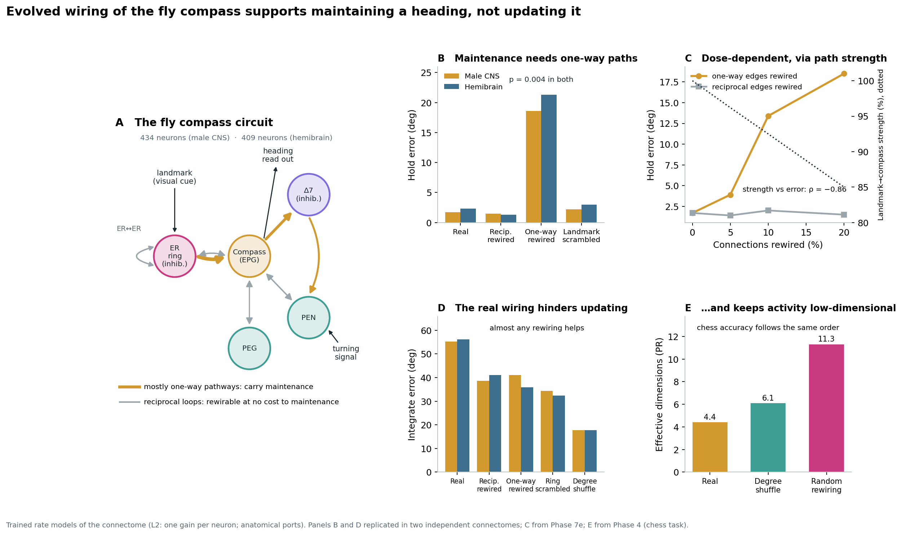</p>

---

## Contents

1. [Project in one page](#1-project-in-one-page)
2. [Repository structure](#2-repository-structure)
3. [Data: the connectomes](#3-data-the-connectomes)
4. [Models](#4-models)
5. [Tasks and metrics](#5-tasks-and-metrics)
6. [Null models and manipulations](#6-null-models-and-manipulations)
7. [Experiment log, phase by phase](#7-experiment-log-phase-by-phase)
8. [Pre-registration ledger](#8-pre-registration-ledger)
9. [Mechanism analyses](#9-mechanism-analyses)
10. [Reproducing everything](#10-reproducing-everything)
11. [Results files](#11-results-files)
12. [Engineering notes and gotchas](#12-engineering-notes-and-gotchas)
13. [Limitations](#13-limitations)
14. [References](#14-references)

---

## 1. Project in one page

**Question.** Does the real wiring of a brain circuit help a network compute, compared with the same neurons wired differently — and if so, which aspect of the wiring matters, for which computation?

**System.** The *Drosophila* head-direction (compass) circuit — EPG, PEN, PEG, Δ7 and ER ring neurons — taken from two independent connectomes, simulated as a spiking reservoir and as trainable rate networks whose wiring mask and excitatory/inhibitory signs stay fixed.

**Story of the results.**

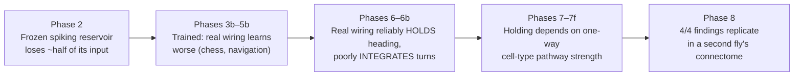

**Headline finding (replicated in two connectomes).** In the fly compass circuit, the ability to hold a heading depends on cell-type-level pathway strengths carried by one-way connections, not on neuron-level maps or reciprocal connections. The same wiring hinders updating the heading, which almost any rewiring improves, and keeps network activity low-dimensional.

---

## 2. Repository structure

All scripts live in the repository root because they import each other by module name. Figures live in `docs/`.

```
chessfly/
├── README.md
├── requirements.txt
├── docs/
│   ├── TECHNICAL.md                  ← this file
│   └── fig1 … fig12 (*.png)          ← all figures
│
├── ── Phase 1: CPU prototype (laptop) ──────────────────────────
├── pull_subnetwork.py                v1 network (68 neurons, all excitatory)
├── check_columns.py                  neuPrint return-order diagnostic
├── build_lif_simulator.py            first Brian2 sanity simulation
├── day3_chess_encoder.py / day3_chess_reservoir.py
├── day3_5_calibration.py / day3_6_calibration.py / day3_7_calibration.py
├── fetch_nt.py                       neurotransmitter lookup
├── pull_subnetwork_v2.py             CURRENT network: 434 neurons + NT signs
├── reservoir_core.py                 locked spiking reservoir + board encoder (Brian2)
├── day4_build_dataset.py / day4_train_readout.py
├── day5_play_games.py
├── day6_build_vs_random.py / day6_train_readout.py / day6_play_games.py
│
├── ── Phases 2–8: GPU experiments (Kaggle) ─────────────────────
├── kaggle_phase2_PART1.py            ┐ concatenated at run time into kaggle_phase2.py:
├── kaggle_phase2_PART2.py            ┘ dataset, GPU simulator, frozen-reservoir experiments
├── kaggle_phase3.py                  trainable connectome (no bottleneck)
├── kaggle_phase3b.py                 bottleneck design, learning curves, degree-preserving null
├── kaggle_phase4.py                  dimensionality + model export for the demos
├── kaggle_phase5.py                  navigation, arbitrary ports
├── kaggle_phase5b.py                 navigation, anatomical ports
├── kaggle_phase6.py                  flexibility sweep L0–L3, hold + integrate
├── kaggle_phase6b.py                 null distribution (30 + 30 networks)
├── kaggle_phase7b.py                 dose-response (partial shuffling)
├── kaggle_phase7d.py                 targeted vs control rewiring (symmetry)
├── kaggle_phase7e.py                 replication + dose, fresh networks
├── kaggle_phase7f.py                 pathway-map scrambles
├── kaggle_phase8.py                  replication in the hemibrain connectome
│
├── ── Analyses without GPU ──────────────────────────────────────
├── analysis_phase7.py                Phases 7, 7c, 7g (mechanism measures)
├── make_figures.py                   figures 9–12
│
└── ── Results (CSV) ───────────────────────────────────────────
    phase5b_navigation.csv, phase6_flexibility.csv, phase6b_null_distribution.csv,
    phase7_mechanism.csv, phase7b_dose_response.csv, phase7c_symmetry.csv,
    phase7e_replication.csv, phase7f_pathways.csv, phase7g_landmark_drive.csv,
    phase8_hemibrain.csv, hemibrain_neurons.csv
```

### Module dependencies

Later phases reuse earlier code instead of copying it:

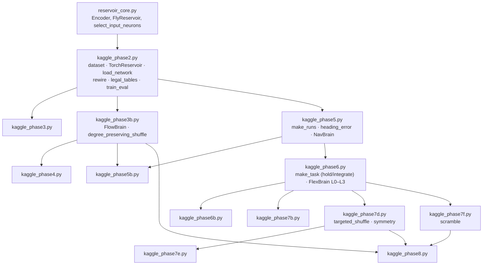

---

## 3. Data: the connectomes

| | Male CNS (main) | Hemibrain (replication) |
|---|---|---|
| neuPrint dataset | `male-cns:v1.0` | `hemibrain:v1.2.1` |
| Fly | adult male | adult female |
| Cell types pulled | regex `(EPG.*\|PEG.*\|PEN.*\|Delta7.*\|ER[1-6].*)` | same |
| Neurons | 434 (32 cell types) | 409 |
| Connections (≥ 3 synapses, summed over ROIs) | 33,783 | see `phase8_hemibrain.csv` |
| EPG / PEN / PEG / Δ7 / ER | 50 / 42 / 18 / 42 / 282 | 50 / 42 / 18 / 42 / 257 |
| Inhibitory neurons | 324 (74.7%), 77.7% of synaptic weight | by cell type (same rule) |
| Reciprocated edges · symmetry | 60% · 0.813 | — · 0.787 |

<p align="center">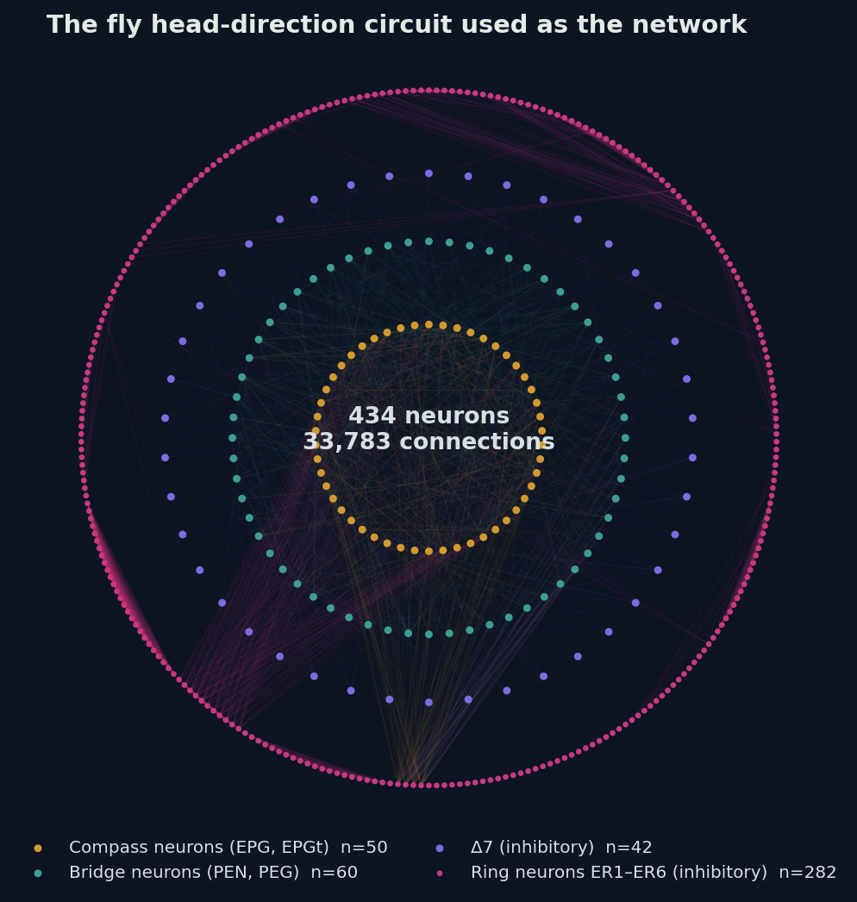</p>

**Signs.** Male CNS: from neuPrint's cell-type neurotransmitter predictions (acetylcholine excitatory; GABA and glutamate inhibitory). Hemibrain: by cell type with the same outcome (EPG, PEN, PEG excitatory; Δ7, ER inhibitory). The type rule reproduces the male CNS predictions exactly.

**Availability note.** `male-cns:v1.0` stopped being listed for our token during the project. Every experiment uses a saved copy (`subnetwork_*` files), rebuilt and verified from `portal_models.json` when needed (identical neuron count, connection count, inhibitory count and input-neuron selection). On Kaggle these files are attached as the private dataset `chessfly-network`.

### Cell-type pathways that matter

| Pathway | % of edges reciprocated | Share of all one-way synapses |
|---|---:|---:|
| ER → EPG (landmark → compass) | 22% | **58%** |
| EPG → Δ7 | 7% | **15%** |
| ER → ER | 85% | 7% |
| Δ7 → PEN | 0% | 5% |

---

## 4. Models

### 4.1 Frozen spiking reservoir (Phases 1–2, 4, demos)

Leaky integrate-and-fire network, implemented in Brian2 (`reservoir_core.py`) and as a batched GPU simulator (`TorchReservoir` in `kaggle_phase2`).

| Parameter | Value |
|---|---|
| Membrane | τ = 10 ms, rest = reset = −65 mV, threshold −50 mV, 3 ms refractory |
| Noise | σ = 1 mV (Euler–Maruyama, dt = 0.1 ms) |
| Synapses | instantaneous jump `count × 0.22 mV × sign(pre)`; v clipped to [−80, 0] mV each step |
| Input | 48 neurons (one per cell type by out-degree, then top-up), constant current `sigmoid(projection) × 30 mV` |
| Duration | 1 s per position; readout = spike counts of the 386 non-input neurons (optionally 10 × 100 ms bins) |

**Validation.** The GPU simulator matches Brian2 on 8 positions: per-neuron rate correlation **r = 0.999**, mean rates 16.24 vs 16.40 Hz. Matching required one subtle rule: Brian2 discards synaptic input to refractory neurons.

### 4.2 Trainable rate networks (Phases 3–8)

```
h ← (1 − α) h + α ( ReLU(h) W + U x )          α = 0.5
W = sign(pre) · magnitude · mask                mask, sign fixed; magnitudes trained (level-dependent)
```

| Class (script) | Used in | Input | Readout | Recurrent steps |
|---|---|---|---|---|
| `ChessBrain` (3) | 3 | board → all neurons | all neurons | 10 per position |
| `FlowBrain` (3b) | 3b, 4 | board → 150 sensory neurons | other 284 | 10 per position |
| `NavBrain` (5) | 5 | 4 inputs → 150 sensory | other 284 | 2 per time step |
| `PortBrain` (5b) | 5b | turning → PEN, landmark → ER | EPG | 2 per time step |
| `FlexBrain` (6) | 6–8 | anatomical ports | EPG | 2 per time step |

**Initialization.** Magnitudes start at synapse counts scaled so the signed weight matrix has spectral radius 0.9.

**Learning-freedom levels (`FlexBrain`).**

| Level | Trainable inside the circuit | Count (male CNS) |
|---|---|---:|
| L0 | nothing (weights frozen at scaled counts) | 0 |
| L1 | one gain per (pre cell type, post cell type) pair | 421 |
| L2 | one gain per presynaptic neuron (**default from Phase 6b on**) | 434 |
| L3 | every synapse | 33,783 |

Input and readout layers are always trained.

### 4.3 Training

Adam (lr 1e-3), gradient clipping at 1.0, early stopping on validation every 250 steps. Chess: batch 512, 3,000 steps, cross-entropy over legal moves. Navigation: batch 128, 2,000 steps, mean squared error on (cos θ, sin θ).

---

## 5. Tasks and metrics

### 5.1 Chess move prediction (Phases 2–4)

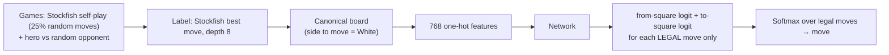

100,000 positions, split by game (70/15/15). Metric: top-1 / top-3 agreement with Stockfish on held-out games. Illegal moves are impossible by construction.

### 5.2 Navigation (Phases 5–8)

A simulated fly turns randomly; turning rate follows `w ← 0.85 w + N(0, 0.08)`, clipped to ±0.35 rad per step. A landmark gives the true heading for the first 5 steps.

| Task | Turning input | Tests |
|---|---|---|
| **Hold** | zero (no turning, darkness after the cue) | maintenance: keeping a value in memory |
| **Integrate** | random turning | updating: rotating the heading by integrating turns |

**Metric.** Mean absolute heading error in degrees after the cue (90 = chance), on 2,000 test runs of the training length (40 steps) and on runs twice as long (80 steps). An error near 88° means a network that never learned the task ("failure").

---

## 6. Null models and manipulations

All manipulations keep neuron identities and cell types; only edges change.

| Name | Function | What is preserved | What changes |
|---|---|---|---|
| **Random rewiring** | `rewire` (phase 2) | each neuron's outgoing weights | targets permuted → in-degrees scrambled |
| **Degree-preserving shuffle** | `degree_preserving_shuffle` (3b) | in- and out-degree of every neuron | ~66% of edges relocated (density limit) |
| **Partial shuffle** | `partial_degree_shuffle` (7b) | degrees | a chosen fraction of edges moved |
| **Targeted / control** | `targeted_shuffle` (7d) | degrees; no new reciprocal pairs | only reciprocal (target) or only one-way (control) edges move |
| **Pathway scramble** | `scramble` (7f) | pathway totals, strengths, source degrees | target neurons relabeled inside one pathway |

Verification checks used throughout: degree sequences identical after shuffling; symmetry and pathway strengths reported for every network; seeds fixed so any network can be rebuilt exactly.

---

## 7. Experiment log, phase by phase

### Phase 1 — CPU prototype

| Step | Problem found | Fix |
|---|---|---|
| v1 network (68 neurons) | 100% excitatory → network silent or runaway | pull Δ7 and ring neurons (`pull_subnetwork_v2.py`) |
| Poisson input | noise swamped between-position differences | deterministic current, centered encoding |
| Result | 100% decoding of 8 positions, separation 11.6× noise | locked config in `reservoir_core.py` |

Day 4–6 (5,000 positions): fly reservoir ≈ its own 48-value input in move prediction; in 20 games vs a random player the frozen fly scored 0.55 (not significant).

### Phase 2 — frozen reservoir at scale

<p align="center">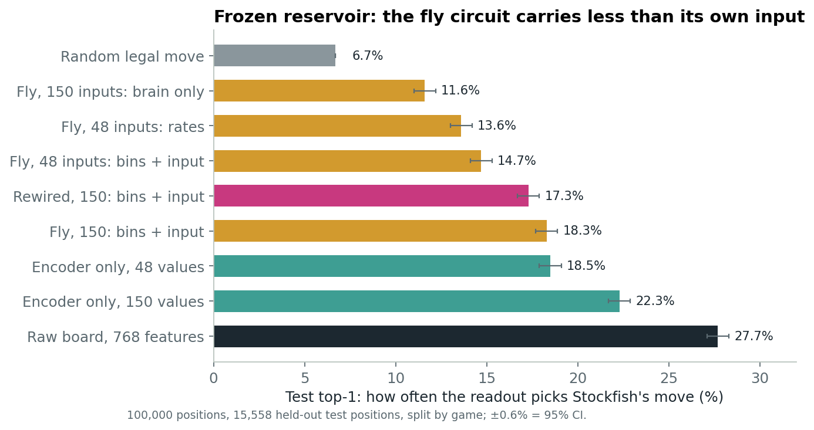</p>

The frozen fly circuit retains less information than its own input: brain-only readout 11.6% vs encoder 22.3% top-1 (test n = 15,558).

### Phase 3 — trainable, no bottleneck

Real, rewired and **no-recurrence** networks all reached 29.1%: the task was solved without using the synapses, so this design cannot test the wiring.

### Phase 3b — information forced through the wiring

<p align="center">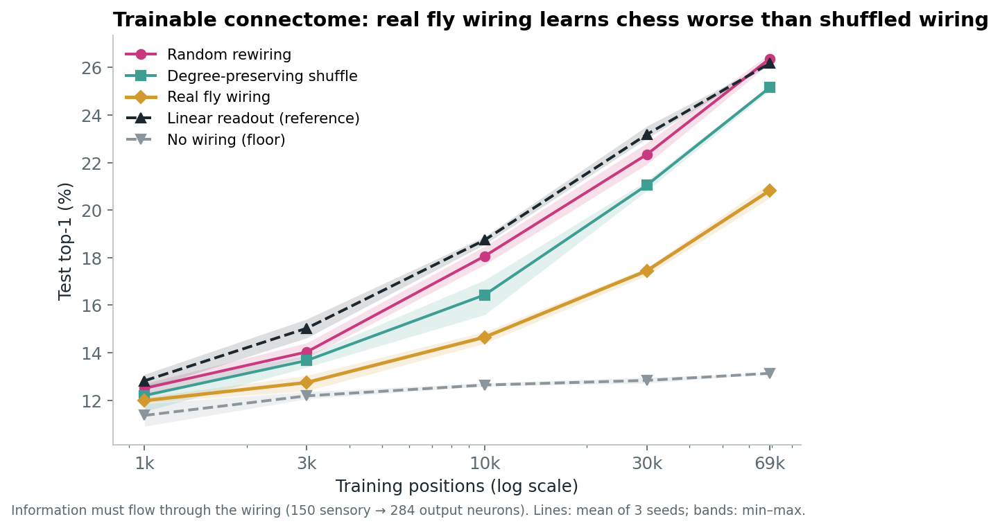</p>

Real wiring learned chess worse than both nulls at 4 of 5 training-set sizes (20.8% vs 25.2% and 26.4% at 69k positions).

### Phase 4 — dimensionality

<p align="center">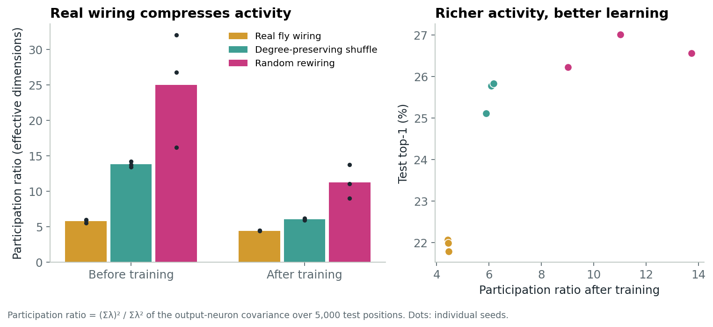</p>

Participation ratio after training: real 4.4 < degree-preserving 6.1 < rewired 11.3, the same order as chess accuracy.

### Phases 5 and 5b — navigation

Real wiring integrated turns worse than both nulls, with arbitrary ports (~12° vs 4–7°) and with anatomical ports (31–44° vs 7–10°).

### Phase 6 — learning-freedom sweep

<p align="center">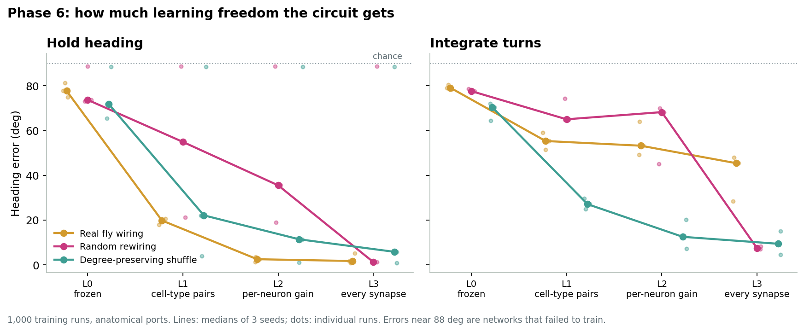</p>

No crossover. On **hold**, the real wiring never failed and reached ~2° at L2; shuffled networks were all-or-nothing. On **integrate**, the real wiring was worst at every level.

### Phase 6b — null distribution

<p align="center">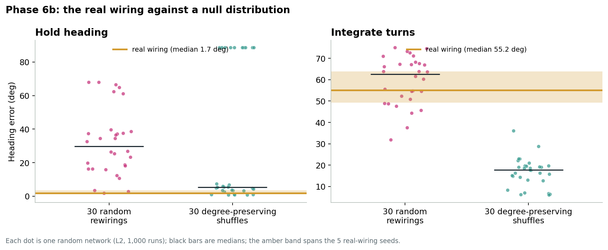</p>

| Task | Real median | vs 30 rewired | vs 30 degree-preserving |
|---|---:|---|---|
| Hold | 1.7° | beats 97% (p = 0.0001) | beats 80% (p = 0.028); 10/30 nulls failed |
| Integrate | 55.2° | beats 60% | beats 0% |

The useful structure for holding is largely in the degree sequence; beyond it, the exact wiring is neutral for holding and harmful for integrating.

### Phase 7b — gradual shuffling

<p align="center">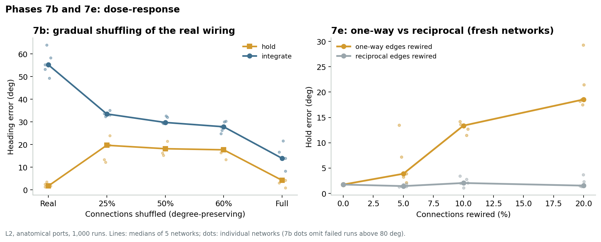</p>

Holding is a fragile optimum (1.7° → 19.7° after shuffling 25% of edges); integration improves monotonically with shuffling (55° → 14°).

### Phase 7d — targeted vs control rewiring (20% of edges)

| Condition | Symmetry | Hold | Integrate |
|---|---:|---:|---:|
| Real | 0.813 | 1.7° | 55.2° |
| Reciprocal edges rewired | 0.629 | 1.9° | 32.0° |
| One-way edges rewired | 0.813 | 26.2° | 41.7° |

### Phase 7e — replication with fresh networks (5%, 10%, 20%)

Rewiring one-way edges degrades holding step by step (ρ = +0.92); rewiring reciprocal edges has no effect. The integration advantage of reciprocal rewiring seen in 7d did **not** replicate (38.6° vs 41.1°, p = 0.35).

### Phase 7f — scrambling the map inside single pathways

<p align="center">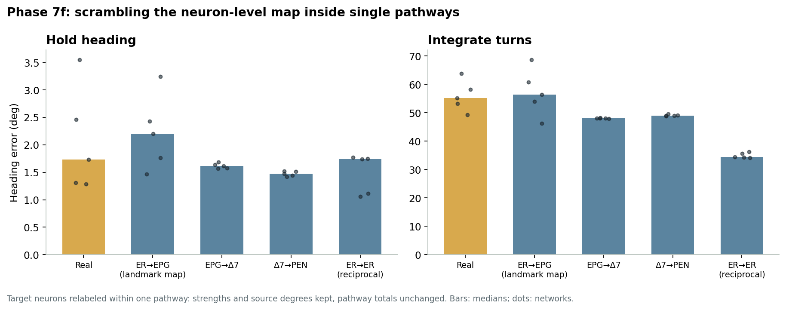</p>

No single-pathway scramble hurts holding — including the landmark map (ER → EPG). Neuron-level detail within a pathway does not matter for maintenance.

### Phase 8 — replication in the hemibrain

<p align="center">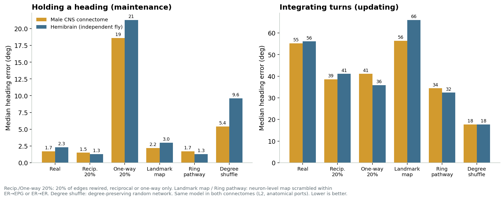</p>

| Replication test | Male CNS | Hemibrain | |
|---|---|---|---|
| R1 one-way rewiring hurts holding more than reciprocal | 18.6° vs 1.5° | 21.3° vs 1.3° (p = 0.004) | ✅ |
| R2 landmark-map scramble does not hurt holding | 2.2° vs 1.7° | 3.0° vs 2.3° (p = 0.27) | ✅ |
| R3 degree-preserving shuffles integrate better | 17.7° vs 55.2° | 17.7° vs 56.1° (p = 0.0003) | ✅ |
| R4 less ER → EPG strength, more holding error | ρ = −0.86 | ρ = −0.73 (p = 0.016) | ✅ |

---

## 8. Pre-registration ledger

Every decision rule was written into the script before it ran. Failed predictions are part of the record.

| Phase | Prediction | Outcome |
|---|---|---|
| 3b | Real wiring learns chess differently from nulls | ✅ worse at 4/5 sizes |
| 5 | Real wiring wins at navigation (double dissociation with chess) | ❌ loses |
| 5b | With anatomical ports, real wiring wins | ❌ loses, more strongly |
| 6 | Crossover: real wins at low freedom, loses at high | ❌ no crossover |
| 6b | Real beats ≥ 95% of both null types on hold | ❌ 97% vs rewired, 80% vs degree-preserving |
| 7b | Integration follows slow-mode count, not randomness | ❌ follows randomness |
| 7d | (1) symmetry breaking helps integrate · (2) hurts hold | ✅ (1) · ❌ (2) reversed |
| 7e | P1 hold dissociation · P2 integrate dissociation · P3 dose | ✅ P1 · ❌ P2 · ✅ P3 |
| 7f | Holding depends on the landmark map (routing) or internal loops | ⚪ neither single pathway |
| 8 | 4 core findings replicate in the hemibrain | ✅ 4/4 |

---

## 9. Mechanism analyses

These run on a CPU (`analysis_phase7.py`), rebuilding every network from its seed.

### Phase 7 — eigenvalue spectra (61 networks from Phase 6b)

<p align="center">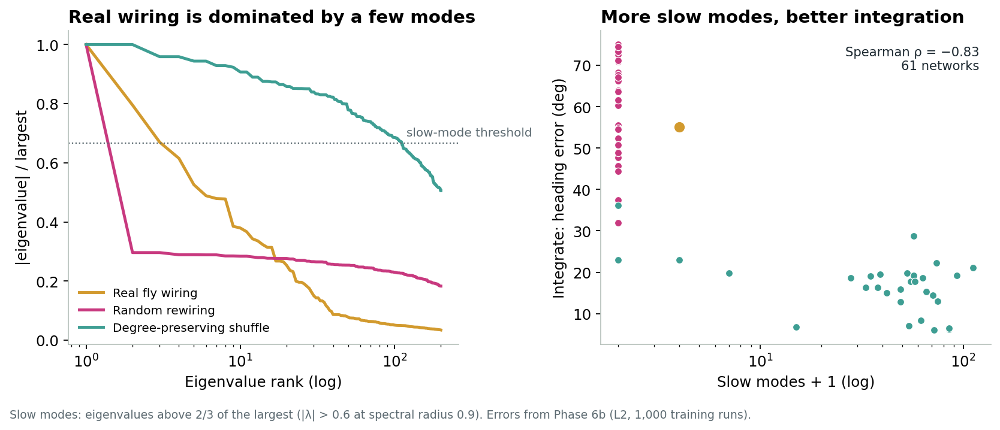</p>

The real wiring is dominated by a few modes (3–4 slow modes vs ~50–150 for degree-preserving shuffles). Slow modes predict integration across networks (ρ = −0.83), but Phase 7b showed this does not hold causally.

### Phase 7c — symmetry (21 networks from Phase 7b)

<p align="center">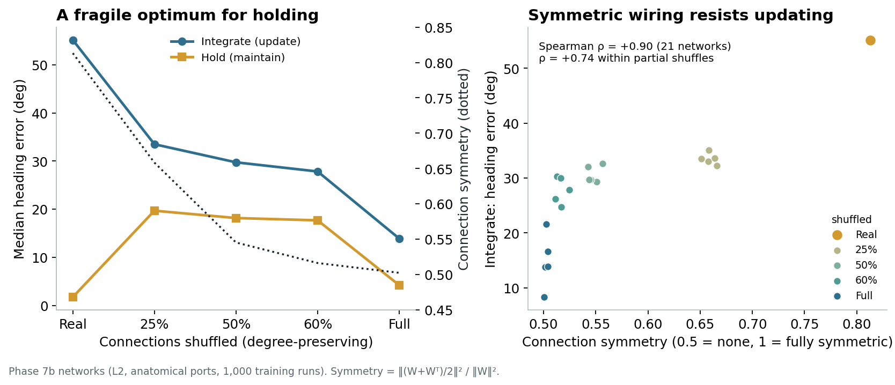</p>

Symmetry predicts integration error (ρ = +0.90; +0.74 within partial shuffles), but Phase 7e showed one-way rewiring helps integration as much as reciprocal rewiring, so symmetry is not a specific cause.

### Phase 7g — cell-type pathway strength (31 networks from Phase 7e)

| One-way rewiring | ER → EPG strength | Hold error |
|---|---:|---:|
| 0% | 100% | 1.7° |
| 5% | 96% | 3.9° |
| 10% | 93% | 13.4° |
| 20% | 85% | 18.5° |

ER → EPG strength predicts holding error (ρ = −0.86; −0.85 within one-way-rewired networks). EPG → Δ7 strength is correlated with it, so the two cannot yet be separated.

---

## 10. Reproducing everything

### 10.1 Kaggle notebook (GPU T4)

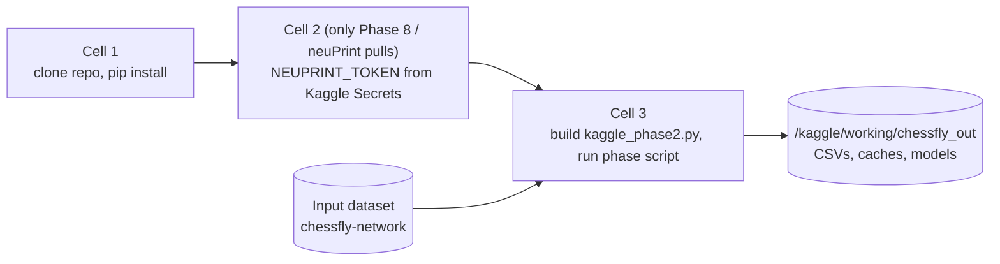

```python
# Cell 1
![ -d chessfly ] || git clone https://github.com/donti507/chessfly.git
!pip install -q brian2 python-chess neuprint-python

# Cell 2 (Phase 8 only; requires the NEUPRINT_TOKEN secret)
import os
from kaggle_secrets import UserSecretsClient
os.environ["NEUPRINT_TOKEN"] = UserSecretsClient().get_secret("NEUPRINT_TOKEN")

# Cell 3 (replace kaggle_phase6b.py with any phase)
!cd chessfly && git pull && cat kaggle_phase2_PART1.py kaggle_phase2_PART2.py > kaggle_phase2.py && python kaggle_phase6b.py
```

Run long phases with **Save Version → Save & Run All (Commit)** so outputs persist after the session ends.

### 10.2 Runtimes and outputs

| Phase | Runs | T4 time | Output |
|---|---:|---:|---|
| 2 (100k positions) | 8 readouts | ~45 min | `phase2_results.csv` |
| 3b | 75 | ~25 min | `phase3b_results.csv` |
| 4 | 9 + export | ~30 min | `phase4_dimensionality.csv`, `portal_models.json` |
| 5b | 54 | ~70 min | `phase5b_navigation.csv` |
| 6 | 144 | ~3.3 h | `phase6_flexibility.csv` |
| 6b | 130 | ~3 h | `phase6b_null_distribution.csv` |
| 7b | 50 | ~75 min | `phase7b_dose_response.csv` |
| 7d | 30 | ~45 min | `phase7d_symmetry_causal.csv` |
| 7e | 70 | ~95 min | `phase7e_replication.csv` |
| 7f | 50 | ~70 min | `phase7f_pathways.csv` |
| 8 | 70 | ~100 min | `phase8_hemibrain.csv`, `hemibrain_*.npz/csv` |

### 10.3 Environment variables

| Variable | Scripts | Meaning |
|---|---|---|
| `N_POSITIONS` | 2, 3, 3b, 4 | chess dataset size (default 50k; 100k used) |
| `SEEDS`, `SIZES` | 3b, 5, 6 | training seeds, training-set sizes |
| `N_NULL`, `NULLS`, `NETS`, `REAL_SEEDS` | 6b–8 | number of null / manipulated networks, real-wiring seeds |
| `FRACS`, `FRAC` | 7b, 7d, 7e | fractions of edges rewired |
| `LEVELS`, `TASKS`, `KINDS`, `CONDITIONS` | 3–8 | subsets of the design |
| `DATASET` | 8 | neuPrint dataset for replication |

### 10.4 CPU analyses and figures

```bash
python analysis_phase7.py all     # Phases 7, 7c, 7g → phase7*_*.csv (reproduces saved results exactly)
python make_figures.py            # figures 9–12 → docs/
```

---

## 11. Results files

| File | Rows | Key columns |
|---|---:|---|
| `phase5b_navigation.csv` | 54 | design, condition, seed, size, test_err, long_err |
| `phase6_flexibility.csv` | 144 | task, level, condition, seed, size, circuit_params, test_err, long_err |
| `phase6b_null_distribution.csv` | 130 | task, condition, train_seed, net_seed, test_err, long_err |
| `phase7_mechanism.csv` | 61 | condition, net_seed, slow_modes, silent_epg, mem_late, hold_err, integrate_err |
| `phase7b_dose_response.csv` | 50 | task, condition, frac, moved, slow_modes, test_err |
| `phase7c_symmetry.csv` | 21 | frac, reciprocity, symmetry, real_top20, hold, integrate |
| `phase7e_replication.csv` | 70 | task, condition, frac, symmetry, test_err |
| `phase7f_pathways.csv` | 50 | task, condition, relocated, symmetry, test_err |
| `phase7g_landmark_drive.csv` | 31 | mode, frac, er_epg, epg_d7, hold, integrate |
| `phase8_hemibrain.csv` | 70 | task, condition, symmetry, er_epg, test_err |

`phase6_flexibility.csv` was reconstructed from the run log after the Kaggle session ended (validation errors not logged); all printed summary statistics match the log exactly.

---

## 12. Engineering notes and gotchas

| Issue | Lesson |
|---|---|
| `fetch_adjacencies()` returns `(neuron_df, conn_df)` | the connection table is the **second** value; it has one row per ROI, so sum over ROIs |
| Exact neuPrint type matching | use `regex=True`, or subtypes like `PEN_a(PEN1)` are missed |
| Brian2 `clip()` inside `on_pre` | not vectorizable in numpy mode (Python-loop fallback); clip on neurons with `run_regularly` instead |
| Brian2 refractoriness | synaptic input to refractory neurons is discarded; the GPU simulator must do the same |
| Kaggle interactive sessions | outputs in `/kaggle/working` vanish when the session stops; use commit runs |
| Long pastes on a phone | files over ~450 lines were truncated; Phase 2 is split into two parts and recombined with `cat` |
| Dense pathways resist swapping | degree-preserving swaps can move at most ~66% of edges overall and ~2.5% inside ER → EPG |
| Tokens | never commit the neuPrint token; read it from `NEUPRINT_TOKEN` (Kaggle Secrets) |

---

## 13. Limitations

- One circuit type (the head-direction circuit), though in two independent connectomes.
- Rate units trained with backpropagation; not a biological learning rule.
- Synapse counts used as initial strengths; true synaptic efficacies are unknown.
- The pathway-strength mechanism is supported by correlation and by indirect manipulations, not yet by directly scaling a single pathway.
- ER → EPG and EPG → Δ7 strengths co-vary under one-way rewiring, so their individual contributions are not separated.
- Hemibrain signs assigned by cell type rather than from neurotransmitter predictions (matching the male CNS predictions).

---

## 14. References

- Lappalainen et al. (2024). Connectome-constrained networks predict neural activity across the fly visual system. *Nature*.
- Mastrogiuseppe & Ostojic (2018). Linking connectivity, dynamics, and computations in low-rank recurrent neural networks. *Neuron*.
- Yu et al. (2025). Biological Processing Units: leveraging an insect connectome to pioneer biofidelic neural architectures. AGI 2025 (LNCS).
- Costi et al. (2025). The Drosophila connectome as a computational reservoir for time-series prediction. *Biomimetics* 10(5):341.
- Suárez et al. (2024). Connectome-based reservoir computing with the conn2res toolbox. *Nature Communications* 15.
- Zador (2019). A critique of pure learning and what artificial neural networks can learn from animal brains. *Nature Communications* 10.
- Data: Janelia FlyEM male CNS connectome (`male-cns:v1.0`) and hemibrain (`hemibrain:v1.2.1`), via neuPrint.
